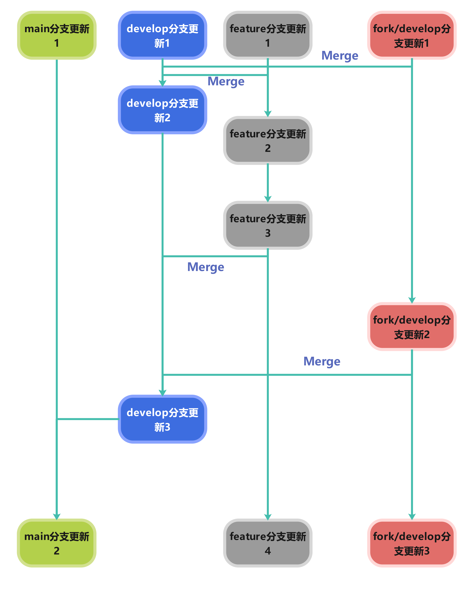

# ❓怎么贡献？
## ⬆️commit message

需要遵循以下格式:
```
更新类型:(更新概括):

- [(可选)子更新类型]更新内容1
- [(可选)子更新类型]更新内容2
- ...
```

更新类型有这些内容:
| 类型 | 说明 |
| --- | --- |
| ✅feat | 新功能 |
| 🐛fix | 修bug  |
| ⚒️refactor |  重构，不新增功能，也不修bug |
| 📃docs | 改文档，比如README |
| ❇️style | 改代码风格，不影响功能 |
| 🔎test | 加测试、改测试 |
| 📆chore | 杂项，比如改.gitignore |
| ⏫perf | 性能优化  |
| 🛒ci | CI/CD相关改动 |
| 🚅build | 改构建系统或依赖 |
| ◀️revert  | 回滚某个提交 |
| 🔡dependency | 依赖更新 |
| ❌remove | 删除弃用的组件 |
| ↪️move | 移动了组件 |
| ❓unknown | 未知类型 |
| 自定义  | 尽量以一个直观的英文单词描述，最好配上emoji |

内容较多时需要对更新内容添加更新类型提示

## 🗂️分支

请按此图所示的分支结构来更新：


创建的分支需要以`feature/`开头，以表示功能分支，或创建一个fork，并在fork的分支开发。

发布pr时要选择**合并到`develop`分支**。

## ❓issue
- 标题格式：`[类型] 标题`
- 内容应准确写出你的需求，并选择性给出解决方案，上传截图，添加附加信息（如clickmouse版本号）
- 类型为`bug`、`enhancement`、`question`等。
- 我们给了一些模板，可直接使用。
- 使用`labels`来标记issue的类型，比如`bug`、`enhancement`、`question`等。
- 安全问题请见[安全说明文档](./SECURITY.md)。

## ❇️pr
- 标题格式：`[类型] 标题`
- 使用`labels`来标记pr的类型，比如`bug`、`enhancement`、`question`等。
- 关联issue，这样我们就可以知道这个pr解决了哪个issue。
- 可选添加实现思路

### 🎫规范
我们pr合并的顺序为：


pr无特定格式，但是必须清晰描述更新内容；标题要简略描述更新内容，若修复或添加了issue里的建议，把该issue编号写进该行为，若出现多个重复issue，则只用写一个，并简单描述此bug。

### ✈️快车pr
> [!WARNING]
> 快车pr请谨慎使用
- 快车pr的意思是跳过部分正常的pr合并分支步骤，以更快的合并到目标分支的功能。
- 标题格式：`[✈️快车] 标题`
- 使用快车必须在pr描述中说明使用的原因

如果有人快车合并，但没写快车合并的原因，则拒绝合并该人的分支。
